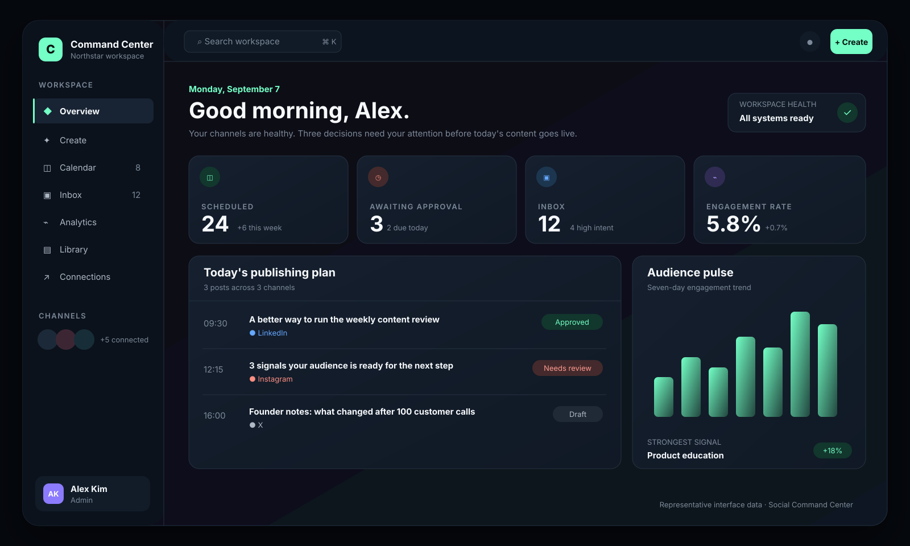
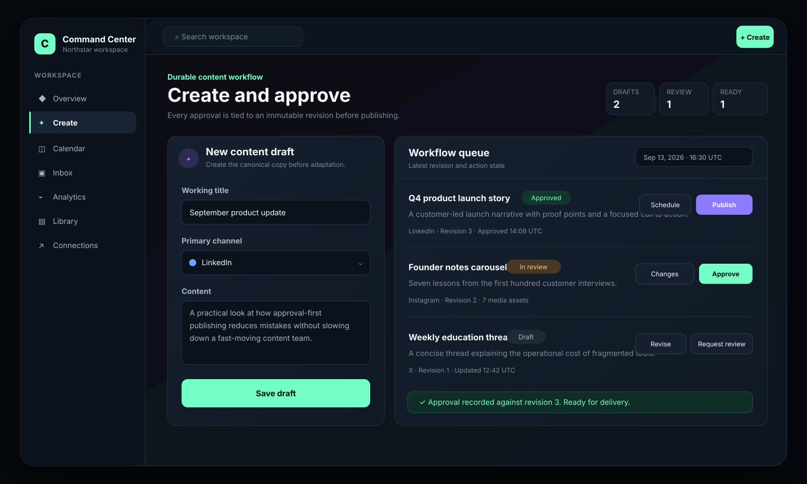
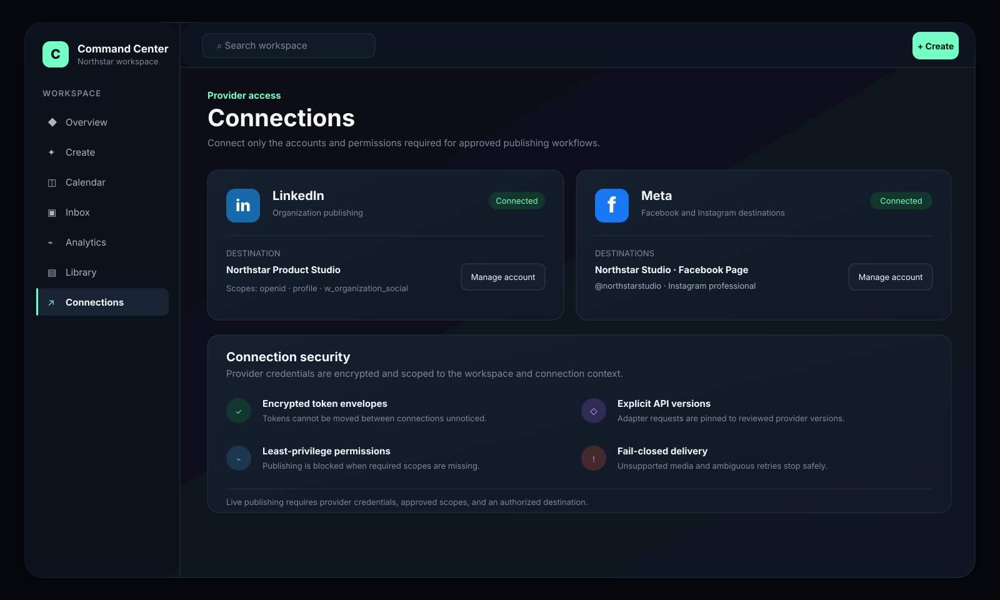
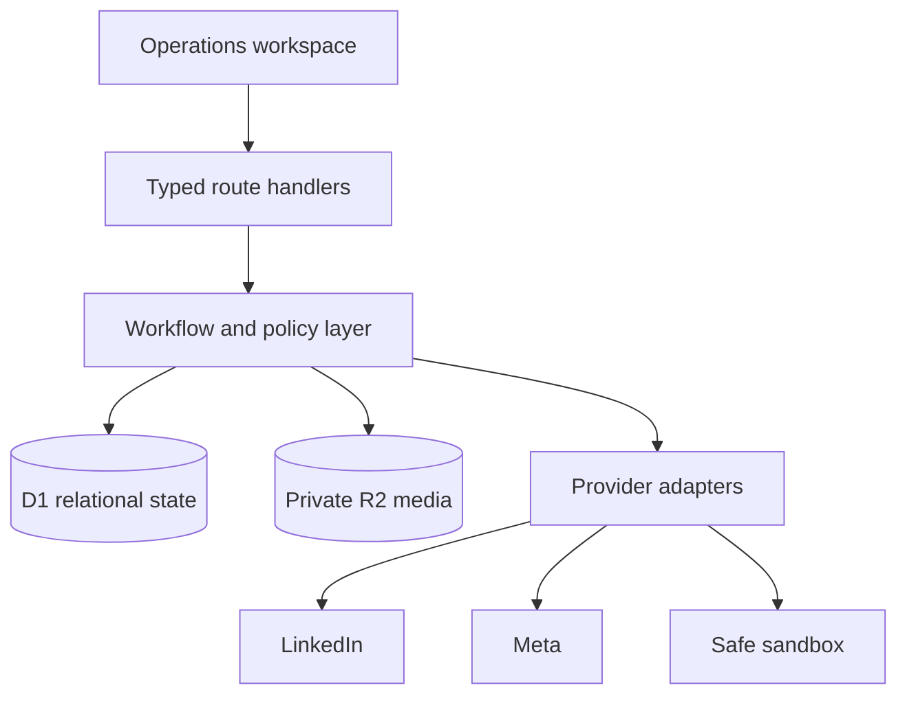

# Social Command Center

### A secure, approval-first workspace for multi-network social publishing

## Case study

Social teams often move between writing tools, spreadsheets, approval threads, media folders, and individual network dashboards. That fragmentation makes it difficult to answer basic operational questions: which revision was approved, what is scheduled, what actually published, and whether retrying a failed request could create a duplicate.

Social Command Center explores a more reliable model: one calm workspace with explicit content states, immutable revisions, private media, human approval gates, provider-aware publishing, and delivery evidence.

**Role:** End-to-end product engineering — product definition, UX, system design, data modeling, API integration, security controls, implementation, and testing.

**Current stage:** Working MVP with durable workflow and storage, LinkedIn and Meta connection foundations, real text-post delivery paths for approved providers, and deterministic sandbox publishing.

## Product experience

| Operations overview | Approval-first workflow |
| --- | --- |
|  |  |
| A prioritized view of schedule, approvals, inbox signals, and channel health. | Draft, revise, review, approve, schedule, publish, and preserve delivery evidence. |

The SVG images are interface mockups with representative data, not browser captures or measured production metrics. Workflow behavior, validation, persistence, adapters, and tests are implemented in the private source.

## What I built

- **Durable content lifecycle:** drafting, review, changes requested, approval, scheduling, publishing, failure, cancellation, and immutable revisions.
- **Safe delivery semantics:** idempotency keys, delivery receipts, explicit provider outcomes, and conservative handling of ambiguous failures.
- **Private media library:** R2-backed uploads, signature/MIME checks, file-size enforcement, deduplication, and revision attachments.
- **LinkedIn integration:** OAuth foundation, least-privilege scope checks, administrator Page discovery, encrypted tokens, and versioned text publishing.
- **Meta integration:** OAuth, long-lived token exchange, Facebook Page and Instagram professional-account discovery, encrypted tokens, and Facebook Page text publishing.
- **Provider abstraction:** live adapters coexist with a deterministic sandbox so workflow logic can be tested without posting publicly.
- **Security boundaries:** workspace-aware records, encrypted credentials, approval-to-revision binding, and fail-closed unsupported paths.

## System design

The domain layer owns state-transition rules and approval gates. Provider adapters translate an approved immutable revision into a network-specific request, while delivery records preserve enough evidence to reconcile the outcome.

## Selected engineering decisions

| Decision | Why it matters |
| --- | --- |
| Approval binds to a revision ID | Editing content after approval cannot silently change what gets published. |
| Idempotency is a first-class record | A retry can reuse a known delivery instead of creating duplicate posts. |
| Tokens are context-bound before encryption | A token envelope cannot be moved to a different workspace or connection unnoticed. |
| File bytes are validated | Upload policy does not trust only the browser-provided filename or MIME type. |
| Unsupported capabilities fail closed | The UI never reports a successful live publish when only a sandbox path exists. |

## Technology

React 19 · TypeScript · Next.js 16 · Vinext · Vite · Tailwind CSS · Cloudflare Workers · D1 · R2 · Drizzle ORM · LinkedIn API · Meta Graph API

## Verification

The private source contains automated tests covering:

- Approval and publishing transition gates
- Sandbox idempotency and invalid-draft rejection
- LinkedIn OAuth, scope enforcement, Page discovery, and publishing requests
- Meta OAuth, token exchange, destination discovery, and Facebook delivery
- Token-envelope encryption and context validation
- Media signature checks, safe names, and byte limits
- Deterministic rendered UI output

Run `npm ci` and `npm test` in the private source to reproduce the checks. The test command builds the application first. A current passing CI run should be verified before describing this checkpoint as tested; mocked provider tests do not establish live LinkedIn or Meta activation.

## Delivery status

| Capability | Status |
| --- | --- |
| Drafts, revisions, approvals, schedules, receipts | Implemented |
| Private media storage and attachments | Implemented |
| LinkedIn connection and text publishing adapter | Implemented; activation requires provider credentials/scopes |
| Facebook Page connection and text publishing adapter | Implemented; activation requires provider credentials/review |
| Instagram destination discovery | Implemented |
| Instagram media publishing | Planned |
| Unified inbox and normalized analytics | Planned |
| Production scheduler, reconciliation, and observability | Next milestone |

## What I would build next

1. Durable scheduled execution with leases, retries, dead-letter handling, and reconciliation.
2. Provider-approved image/video upload flows and capability-aware composition.
3. Webhook ingestion for comments and messages with normalized conversation state.
4. Cross-network analytics with provenance, retention rules, and comparable metrics.
5. Production telemetry, SLOs, operator runbooks, and staged rollout controls.

## Source visibility

The implementation is intentionally private because it contains proprietary product work. This public repository contains only the case study and presentation assets—no application source, secrets, tokens, or deployment configuration.

If you are reviewing this project for an engineering opportunity, I can walk through the architecture, security decisions, trade-offs, and live workflow privately.

---

Built by [Kuxornu Sylvanus](https://github.com/Achidaq).
